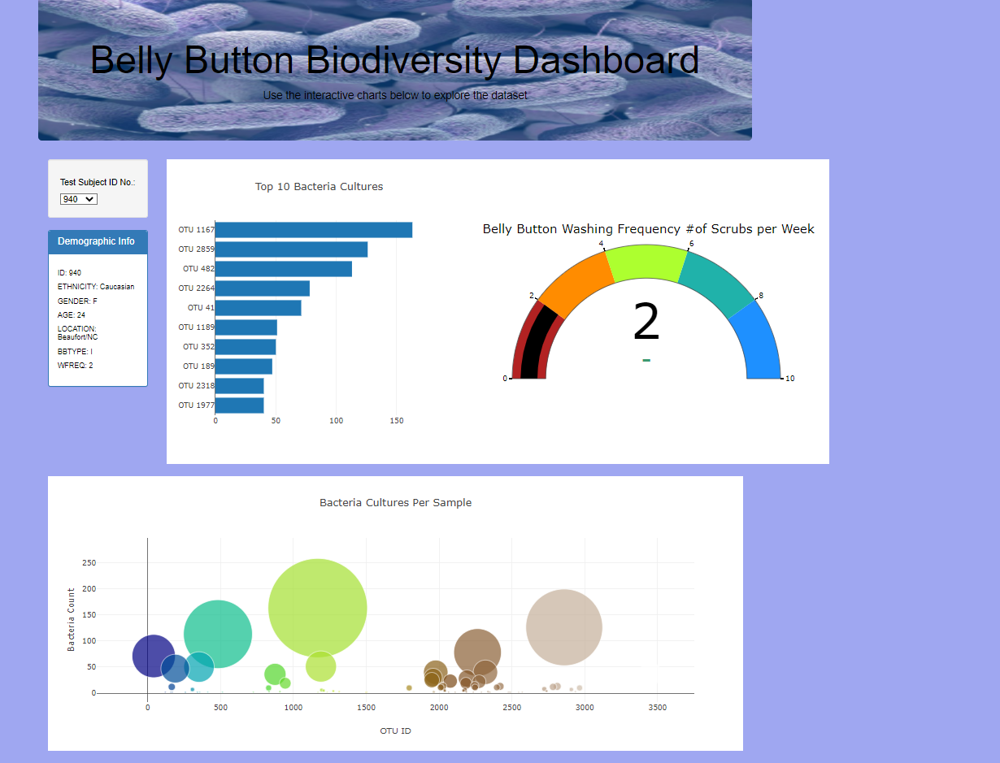

# plotlydiploy
# Belly Button Biodiversity

## Overview

   The goal of the project is to create a dashboard panel with demographid information,from the bacterial data collected from volunteers. 
   Specifically,volunteers should be able to identify the top 10 bacterial species in their belly button.
   
 ## Website
    Please use the link to intearct with the data : Add Link> https://pprave1.github.io/plotlydiploy/
   
   ### Created a horizontal Bar chart
    The horizontal bar chart will display the sample_values as the values, the otu_ids as the labels, and the otu_labels as the hover text for the bars on the chart.
    
 ###  Created a Bubble chart
   The bubble chart that will display the following when an individual’s ID is selected from the dropdown menu webpage:

   viz otu_ids as the x-axis; sample_values as the y-axis values;sample_values as the marker size; otu_ids as the marker colors;otu_labels as the hover-text values.
    
    
### Created a Gauge Chart
   
   The gauge chart that displays the weekly washing frequency's value, and display the value as a measure from 0-10 on the progress bar in the gauge chart when an individual ID 
   is selected from the dropdown menu.

### Finally customised the dashboard and created a mobile responsive page 

##### Image created  using Javascript and HTML code :

  
  
 #### Mobile responsive page
 
  
  
  
  
